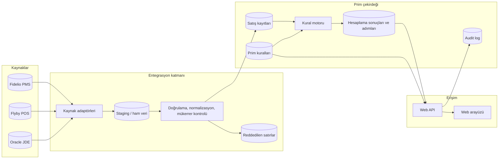
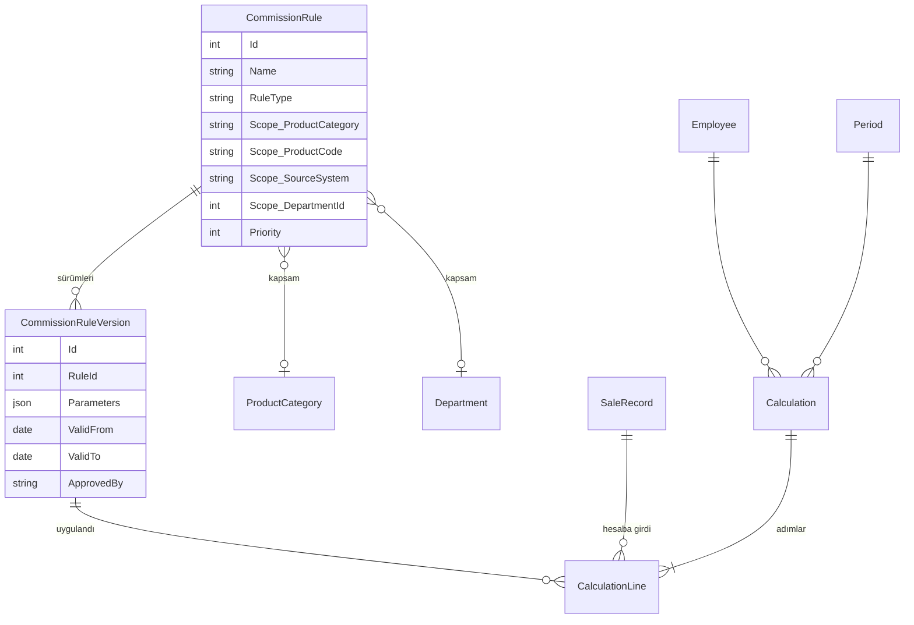

# Çözüm ve Entegrasyon Mimarisi

Bu doküman case'in ilk bölümünü yanıtlar: PMS (Fidelio), POS (Flyby) ve ERP (Oracle JDE) üzerinde dağınık duran satış verisinden, personelin şeffaf biçimde görebildiği, denetlenebilir ve kural değişikliklerine kod yazmadan uyum sağlayan bir prim sistemine nasıl gidilir. Repodaki uygulama bu mimarinin küçük bir dilimidir; her bölümün sonunda hangi parçanın kodda karşılığı olduğu belirtilmiştir.

## 1. Genel görünüm



Üç katman birbirinden ayrı tutulur:

- **Entegrasyon katmanı** kaynak sistemlere dokunan tek yerdir. Kaynakların formatı, protokolü ve tuhaflıkları burada soğurulur; çekirdek tek bir standart satış kaydı modeli görür.
- **Prim çekirdeği** satış kayıtları, kurallar ve hesaplama sonuçlarını tutar. Kural motoru kaynakları bilmez, yalnızca normalize satış kaydı ve kural tanımı ile çalışır.
- **Erişim katmanı** rol tabanlı API ve arayüzdür. Personel kendi sonucunu adım adım görür; muhasebe ve yönetim dönem bazında yönetir.

## 2. Veri entegrasyonu (ETL)

### 2.1 Gerçek zamanlı mı, gecelik batch mi?

Tercih: **gecelik (ve gün içi birkaç kez tekrarlanabilen) batch ETL**, gerçek zamanlı API entegrasyonu değil. Gerekçeler:

- **Prim aylık kapanan bir süreçtir.** Personelin primini saniyeler içinde görmesi değil, doğru ve mutabık görmesi önemlidir. Gün sonu (night audit) sonrası veri zaten kararlı hale gelir; gün içinde PMS'te düzeltme, iptal, oda değişikliği yaşanır.
- **Kaynaklar batch'e uygun, real-time'a değil.** Fidelio ve JDE gibi sistemlerde güvenilir olay akışı (event stream) kurmak lisans, sürüm ve operasyon maliyeti getirir. Rapor çıktısı, veritabanı görünümü (view) ya da dosya paylaşımı çok daha kararlı ve düşük risklidir.
- **Muhasebe mutabakatı.** ERP'de bir kayıt `UNPOSTED` iken prim hesabına girmemelidir. Batch, "muhasebeleştirilmiş kesin veri" ile çalışmayı doğal olarak sağlar.
- **Yeniden çalıştırılabilirlik.** Bir günün aktarımı hatalı olduğunda o günü baştan çalıştırmak, olay tabanlı sistemde eksik olayı yakalamaktan çok daha kolaydır.

Gerçek zamanlılığın istendiği tek yer personelin "bugün ne sattım" merakıdır. Bunun için gün içinde 2–3 saatte bir ara batch (yalnızca son N saatin verisini çeken artımlı aktarım) yeterlidir; gün sonu batch'i kesin veriyi getirir ve önceki ara kayıtları idempotent şekilde üzerine yazar.

### 2.2 Aktarım hattı

Her kaynak için aynı beş adım:

1. **Extract – kaynak adaptörü.** Kaynağa göre değişir: Fidelio için gece raporu dosyası ya da Opera/Fidelio'nun sunduğu salt okunur DB görünümü; Flyby POS için satış detay dışa aktarımı; JDE için `F0911` benzeri muhasebe tablolarına bakan salt okunur sorgu ya da JDE Orchestrator çıktısı. Adaptör yalnızca okur; kaynakta hiçbir yazma yetkisi yoktur.
2. **Landing / staging.** Ham veri değiştirilmeden, aktarım partisi (batch) kimliği ve alınma zamanı ile staging tablosuna yazılır. Ham halin saklanması hem hata ayıklama hem denetim için gereklidir: "sistem bu satırı neden reddetti" sorusuna ham satır ile cevap verilir.
3. **Doğrulama ve normalizasyon.** Tarih biçimi, tutar biçimi (`2.500,00` ile `2500.00`), para birimi, personel sicilinin listede olması, ürün kodunun kataloğa eşlenmesi, belge tipinin (satış / iade / iptal) çözülmesi. Kural: **hatalı satır aktarımı durdurmaz**, reddedilenler tablosuna sebebiyle yazılır ve muhasebe ekranında görünür. Eksik personel ya da bilinmeyen ürün gibi durumlar bir uyarı listesi olarak ilgili departmana düşer.
4. **Mükerrer kontrolü ve idempotent yükleme.** Her kaynak için doğal anahtar tanımlanır: PMS belge no + ürün, POS fiş no + PLU, ERP belge no + satır. Yükleme `upsert` mantığıyla yapılır; aynı dosyanın ya da aynı günün ikinci kez çalışması ne çift kayıt üretir ne hata verir. Değişen kayıt (örneğin tutar düzeltmesi) güncellenir ve bu güncelleme audit log'a düşer.
5. **Mutabakat (reconciliation).** Batch sonunda kaynak toplamları ile yüklenen toplamlar karşılaştırılır: satır sayısı, tutar toplamı, iade toplamı. Sapma eşiği aşıldığında dönem hesaplaması otomatik başlatılmaz, muhasebeye uyarı gider.

### 2.3 Kaynak bazlı notlar

| Kaynak | Anahtar | İade tespiti | Özel durum |
|---|---|---|---|
| PMS (Fidelio) | BelgeNo + UrunKodu | `IslemTipi = REVERSAL`, negatif tutar | Oda hesabına yazılan ek hizmetler; kasiyer numarası satışı yapan personeldir |
| POS (Flyby) | FisNo + PLU | `IadeMi = E`, negatif adet/tutar | Outlet kodu departmanı verir; aynı fişte birden fazla satır olabilir |
| ERP (JDE) | DocNumber + satır | `DocType = RM` (credit memo), `Reference` orijinal belgeyi gösterir | Yalnızca `POSTED` kayıtlar alınır; iş birimi (`BusinessUnit`) otel koduna, hesap (`ObjectAccount`) gelir kategorisine eşlenir |

**Kaynaklar arası çakışma.** Aynı satış hem PMS'te hem ERP'de görünebilir (PMS'ten muhasebeye aktarılan gelir). Hangi kaynağın "otorite" olduğu prim kalemi bazında tanımlanır: örneğin SPA hizmet satışı için PMS, muhasebe düzeltmeleri (credit memo) için ERP. Bu eşleme prim kalemi kataloğunda tutulur; motor her kalem için yalnızca otorite kaynağın kayıtlarını sayar, diğer kaynak kayıtları çapraz kontrol için kullanılır.

**Para birimi.** TRY dışı satışlar reddedilmez, günün kuru ile TRY'ye çevrilir. Kur tablosu (tarih, para birimi, kur, kaynak: TCMB) ayrı tutulur; hesaplama adımında hem orijinal tutar hem uygulanan kur görünür. Bu repodaki dilimde kur tablosu olmadığından yabancı para satırları hata olarak loglanır.

### 2.4 Güvenlik ve performans

- Kaynak sistemlere yalnızca salt okunur teknik hesaplarla, şifreli kanaldan (VPN içi TLS, SFTP) erişilir. Sırlar (bağlantı bilgileri) uygulama konfigürasyonunda değil, Azure Key Vault ya da benzeri bir kasada durur.
- Artımlı aktarım: tam yükleme yerine son başarılı batch'ten sonraki kayıtlar (`GLDate`, değiştirilme zamanı, belge no aralığı) alınır. Ay kapanışında bir kez tam yükleme yapılıp mutabakat kesinleştirilir.
- Aktarım işleri zamanlayıcı (Hangfire, Quartz ya da Azure Functions timer) ile tetiklenir; her çalıştırma `ImportBatch` kaydı ile izlenir: başlangıç, bitiş, okunan / yazılan / reddedilen satır sayısı.
- Staging ve ana tablolar aynı veritabanında ama ayrı şemalarda tutulur; ana tablolara yazma yetkisi yalnızca ETL servisindedir.

**Kodda karşılığı:** `Import/` altındaki kaynak parser'ları (adaptör), `CsvImportService` (doğrulama, mükerrer kontrolü, `ImportBatch` / `ImportError` tabloları), `ProductCatalog` (ürün ve iş birimi eşlemesi). Staging tablosu ve zamanlayıcı bu dilimde yoktur; CSV yükleme adaptörün dosya tabanlı halidir.

## 3. Esnek prim motoru (Rules Engine)

### 3.1 Tasarım hedefi

Yarın golf dersi satışı prim kapsamına alındığında ya da SPA oranı %5'ten %6'ya çıktığında **kod yazılmamalı, deploy gerekmemeli**. Bunun için kural, koddan bağımsız bir veri kaydı olmalı; kod yalnızca "kural tiplerini" bilmeli.

### 3.2 Veri modeli



- **Kural** kimliği, tipi ve kapsamı taşır. Kapsam alanları (kategori, ürün kodu, kaynak sistem, departman, otel) boş bırakıldığında "tümü" anlamına gelir; birlikte kullanıldığında kesişim alınır.
- **Kural sürümü** parametreleri ve geçerlilik aralığını taşır. Oran değişikliği yeni sürüm demektir; eski sürüm eski dönemler için geçerli kalır. Böylece Temmuz hesabı Ağustos'ta değişen oranla yeniden hesaplandığında bile Temmuz'un oranıyla hesaplanır.
- **Parametreler JSON'dur** ve şeması kural tipine bağlıdır. Tip başına şema kodda (strateji sınıfında) doğrulanır; UI aynı şemadan formu üretir.

### 3.3 Kural tipleri ve strateji deseni

Motor `ICommissionRuleStrategy` arayüzü üzerinden çalışır:

```
Evaluate(kural, personel, kapsamına uyan satış ve iadeler, dönem) → adımlar + ara toplam
```

| Tip | Parametre örneği | Hesap |
|---|---|---|
| Sabit yüzde | `{"percentage": 5}` | satış başına tutar × oran |
| Kademeli barem | `{"mode": "Marginal", "tiers": [{"threshold": 0, "rate": 2}, {"threshold": 30000, "rate": 4}]}` | aylık net toplam dilimlere göre; `Marginal` dilim dilim, `Highest` ulaşılan dilimin oranı tüm tutara |
| İşlem başına sabit tutar | `{"amount": 50}` | işlem sayısı × tutar |
| Hedef bazlı bonus (ileride) | `{"target": 100000, "bonus": 2500}` | aylık toplam hedefi geçince tek seferlik tutar |
| Ekip havuzu (ileride) | `{"percentage": 3, "shareBy": "headcount"}` | departman toplamının yüzdesi personele bölünür |

Yeni tip = yeni strateji sınıfı + DI kaydı; motorun ve UI'ın geri kalanı değişmez. Yeni kural ya da oran değişikliği = veritabanına satır.

### 3.4 Hesaplama akışı ve izlenebilirlik

1. Dönem ve personel için satış / iade kayıtları alınır; istihdam dönemi dışındakiler sebebiyle "hariç" listelenir.
2. Dönemde geçerli kural sürümleri öncelik sırasıyla uygulanır. Her kural yalnızca kendi kapsamındaki kayıtları görür.
3. Her kural için satır satır adım (belge, tutar, oran, prim), ardından kural ara toplamı üretilir. Kademeli baremde dilim satırları ayrıca yazılır.
4. Kurala uymayan satışlar "uygun kural yok" olarak listelenir; bu liste yeni kalem ihtiyacının erken sinyalidir.
5. Toplam yazılır; negatif toplam sıfırlanır ve açıklaması eklenir.

Sonuç **adımlarıyla birlikte saklanır**. Personel ekranında "hangi satış, hangi kural, hangi oran, ara toplam" görünür; muhasebe aynı adımlarla mutabakat yapar.

### 3.5 Kural yönetimi süreci

- **Simülasyon (what-if):** Yeni kural ya da yeni sürüm, kaydedilmeden önce seçilen dönem üzerinde deneme hesabı çalıştırılır; toplam maliyet ve personel bazında fark gösterilir. Motor saf fonksiyon olduğundan (DB yazmadan çalışır) simülasyon aynı kodla yapılır.
- **Onay:** Kural değişikliği "taslak → onay bekliyor → yürürlükte" akışından geçer; oluşturan ile onaylayan farklı kişi olmalıdır (dört göz ilkesi).
- **Geçerlilik tarihleri:** Sürümler ileri tarihli tanımlanabilir; "1 Ekim'den itibaren %6" kuralı Eylül'de girilir, otomatik devreye girer.
- **Kural kataloğu:** Kapsam alanlarında kullanılan ürün kategorileri ve kalemler ayrı bir katalog tablosundan gelir; ürün kodu → kalem eşlemesi de burada tutulur. Yeni ürün kodu geldiğinde kataloğa eklemek yeterlidir.

**Kodda karşılığı:** `Rules/` altındaki üç strateji, `RuleStrategyResolver`, JSON parametre doğrulaması, kapsam alanları ve geçerlilik tarihleri; `CommissionCalculator` saf hesaplama; `CommissionCalculationLines` adım kaydı. Sürüm tablosu ve onay akışı bu dilimde yoktur; oran değişikliği doğrudan kuralı günceller ve audit log'a düşer.

## 4. Veri güvenliği ve denetim

Prim verisi maaşı etkiler; tehdit modeli iki yönlüdür: **dışarıdan** (yetkisiz erişim, veri sızıntısı) ve **içeriden** (satış kaydını ya da oranı lehine değiştirme, hesaplamayı elle düzeltme).

### 4.1 Kimlik ve yetki

- Kimlik doğrulama kurumsal kimlik sağlayıcıdan (Azure AD / Entra ID, OIDC) alınır; uygulama şifre saklamaz. Roller gruptan gelir: **Admin** (kural yönetimi), **Muhasebe** (tüm personel, dönem kapatma, aktarım), **Personel** (yalnızca kendi sonucu), gerekirse **Departman yöneticisi** (kendi ekibi).
- Yetki kontrolü API katmanında, her uçta rol ve veri sahipliği (personel yalnızca kendi sicili) düzeyinde yapılır; UI'daki gizleme güvenlik değil kullanım kolaylığıdır.
- Görevler ayrılığı: kuralı tanımlayan (Admin) ile dönemi kapatan (Muhasebe) aynı kişi olmamalı; kural onayı ikinci bir Admin'den geçmeli.

### 4.2 Değişmezlik ve manipülasyon önleme

- **Satış kayıtları kaynaktan gelir, elle girilmez.** Düzeltme gerekiyorsa kaynak sistemde yapılır ve yeniden aktarılır. Uygulama içi düzeltme yalnızca istisnai, gerekçe zorunlu ve audit'li bir işlemdir; kapalı dönemde tamamen kapalıdır.
- **Dönem kapatma = dondurma.** Kapatılan dönemin satış kayıtları, hesaplama adımları ve kullanılan kural sürümleri değiştirilemez. Kural sonradan değişse de kapalı dönem eski sürümle hesaplanmış halini korur. Yeniden açma yalnızca gerekçe ve ikinci onay ile, tüm zincir audit'e yazılarak yapılabilir.
- **Ham verinin saklanması.** Staging'deki ham satırlar ve reddedilen satırlar saklanır; "veri kaynakta böyle miydi" sorusu cevaplanabilir.
- **Hesaplamanın deterministik olması.** Aynı satış verisi + aynı kural sürümleri + aynı motor sürümü her zaman aynı sonucu üretir. Motor sürümü sonuç kaydına yazılır; şüphe halinde hesaplama yeniden çalıştırılıp karşılaştırılır.
- **Bütünlük zinciri (opsiyonel, ileri seviye).** Audit log ve hesaplama sonuçları için her kayıt bir öncekinin hash'ini içerir (hash chain). Veritabanı yöneticisinin geriye dönük satır değiştirmesi zinciri bozar ve tespit edilir. Alternatif: SQL Server ledger tabloları.

### 4.3 Audit log

Her yazma işlemi için **kim, ne zaman, hangi kayıt, eski değer, yeni değer**:

- Kapsam: prim kuralları, satış kayıtları, dönem durumu, personel bilgileri, kural onayları, elle düzeltmeler, aktarım partileri.
- Yakalama noktası ORM'in change tracker'ıdır (EF Core `SaveChangesInterceptor`); controller'larda unutulacak elle log çağrısı yoktur. Her yazma yolu ister API ister zamanlanmış iş olsun aynı yerden geçer.
- Aktör kimliği kimlik sağlayıcıdan gelen kullanıcı kimliğidir; sistem işleri `system:etl` gibi teknik kimlikle imzalanır.
- Audit tablosuna yalnızca ekleme yapılabilir (append-only); uygulama hesabında `UPDATE`/`DELETE` yetkisi yoktur. Kayıtlar ayrıca merkezi log sistemine (Seq, Elastic, Azure Monitor) akıtılır ki veritabanı ile birlikte silinemesin.

### 4.4 Hesaplama denetimi

- Her hesaplama sonucu: dönem, personel, çalıştıran, zaman, kullanılan kural sürümleri, motor sürümü ve tüm adımlarla saklanır. Aynı dönem için yeniden hesaplama önceki sonucu silmez, yeni sürüm oluşturur; hangisinin "kesin" olduğu dönem kapatma ile belirlenir.
- Dönem kapanışında mutabakat raporu: kaynak toplamları, yüklenen toplamlar, reddedilen satırlar, kural bazında toplam prim, önceki aya göre değişim. Anormal sapma (örneğin bir personelin priminin %300 artması) kapanışı durdurur, gerekçe ister.
- Personel ekranındaki adımlar ile muhasebenin gördüğü adımlar aynı kayıttır; iki ayrı hesap yoktur.

### 4.5 Veri koruma

- Aktarımda TLS, depoda şifreleme (TDE), yedeklerin şifreli tutulması.
- Kişisel veri asgari düzeyde: prim hesabı için misafir adı gerekmez, staging'den sonra ana tabloya taşınmaz. Personel verisi KVKK kapsamında saklama süresi ve erişim politikasına bağlanır.
- Uygulama veritabanına en az yetkiyle bağlanır: ETL hesabı yalnızca staging ve satış tablolarına yazar, API hesabı audit tablosunda yalnızca ekleme yapabilir, raporlama hesabı salt okunurdur.
- Sırlar kasada; loglarda kişisel veri ve tutar maskelenir.

**Kodda karşılığı:** header tabanlı rol kontrolü ve veri sahipliği (`Auth/`, controller'lardaki `[Authorize]` ve personel sicil kontrolü), `AuditSaveChangesInterceptor` ile kural / satış / dönem değişikliklerinin eski-yeni değerle loglanması, dönem kapatma ve kapalı dönemde 409 ile engellenen yazma yolları, hesaplama adımlarının kalıcı saklanması, reddedilen satırların ham haliyle tutulması. Kimlik sağlayıcı, hash zinciri, onay akışı ve merkezi log bu dilimin dışındadır.

## 5. Üretim ortamı için öngörüler

- **Veritabanı:** SQL Server (kurumda mevcut, ledger ve TDE desteği). Bu repoda SQLite kullanılmasının nedeni platformdan bağımsız sıfır kurulum; EF Core sayesinde geçiş provider değişikliğidir.
- **Çalıştırma:** API ve ETL işleri konteyner olarak (Docker / Kubernetes ya da Azure Container Apps), zamanlanmış işler ayrı worker olarak. Aynı imaj, farklı giriş noktası.
- **Ölçek:** Aylık satış hacmi on binler mertebesindedir; hesaplama personel bazında paralel çalıştırılabilir, tüm otel için dakikalar içinde biter. Darboğaz hesaplama değil, kaynak sistemlerden veri çekmedir; bu yüzden artımlı aktarım önemlidir.
- **Gözlemlenebilirlik:** Her batch ve her dönem kapanışı için metrik (süre, satır sayısı, reddedilen oranı); reddedilen oranı eşiği aşınca uyarı.
- **Yol haritası:** kural sürümleme ve onay akışı → simülasyon ekranı → kur tablosu → kaynaklar arası otorite eşlemesi → departman yöneticisi rolü → hash zinciri / ledger.
